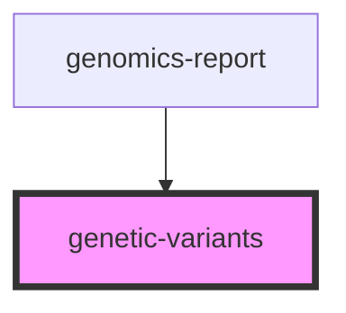

# genetic-variants


<!-- Auto Generated Below -->


## Properties

| Property                | Attribute                  | Description                                                                                                                                                                                                                                                                                                                                                                                                                                                                                                                                                                                                                                                                                                                                                                                                                                                                                 | Type      | Default      |
| ----------------------- | -------------------------- | ------------------------------------------------------------------------------------------------------------------------------------------------------------------------------------------------------------------------------------------------------------------------------------------------------------------------------------------------------------------------------------------------------------------------------------------------------------------------------------------------------------------------------------------------------------------------------------------------------------------------------------------------------------------------------------------------------------------------------------------------------------------------------------------------------------------------------------------------------------------------------------------- | --------- | ------------ |
| `components`            | `components`               | The following components are included by default: <ul>   <li>Gene</li>   <li>Chromosome</li>   <li>Copy Number</li>   <li>Reference</li>   <li>Genomic source class</li>   <li>DNA change type</li>   <li>c.HGVS</li>   <li>p.HGVS</li>   <li>Transcript ID</li>   <li>Sample Allelic Frequency</li>   <li>Allelic read depth</li>   <li>Associated phenotype</li>   <li>Clinical significance</li>   <li>exact-start-end</li>   <li>Ref allele</li>   <li>Alt allele</li>   <li>Left breakpoint position</li>   <li>Right breakpoint position</li>   <li>CNV Size</li>   <li>Exons</li> </ul>  **Example Struktur of a component:** </br> ``` {   system: "http://loinc.org",   code: "62374-4",   display: "Reference",   expression: null,   visible: false,   valueType: "CodeableConcept",   variantTypes: ["snv", "cnv", "sv"]   }   ```   </br> Needs to be an array of JSON objects | `any`     | `undefined`  |
| `geneticObservations`   | `genetic-observations`     | Genetic Observations to be displayed. </br> Needs to be an array of JSON objects                                                                                                                                                                                                                                                                                                                                                                                                                                                                                                                                                                                                                                                                                                                                                                                                            | `any`     | `[]`         |
| `gvTitle`               | `gv-title`                 | Title of the variant table                                                                                                                                                                                                                                                                                                                                                                                                                                                                                                                                                                                                                                                                                                                                                                                                                                                                  | `string`  | `"Variants"` |
| `hideId`                | `hide-id`                  | If `true`, the table will include a column to show the ID.                                                                                                                                                                                                                                                                                                                                                                                                                                                                                                                                                                                                                                                                                                                                                                                                                                  | `boolean` | `false`      |
| `showColumnHideOptions` | `show-column-hide-options` | If `true`, the component will show a button to select column options.                                                                                                                                                                                                                                                                                                                                                                                                                                                                                                                                                                                                                                                                                                                                                                                                                       | `boolean` | `true`       |
| `tableBackground`       | `table-background`         | Defines colour of the table background                                                                                                                                                                                                                                                                                                                                                                                                                                                                                                                                                                                                                                                                                                                                                                                                                                                      | `string`  | `""`         |
| `tableHeaderBackground` | `table-header-background`  | Defines colour of the table-header background                                                                                                                                                                                                                                                                                                                                                                                                                                                                                                                                                                                                                                                                                                                                                                                                                                               | `string`  | `""`         |
| `type`                  | `type`                     | Can be one of the following: "snv", "cnv", "sv"                                                                                                                                                                                                                                                                                                                                                                                                                                                                                                                                                                                                                                                                                                                                                                                                                                             | `string`  | `"snv"`      |


## Dependencies

### Used by

 - [genomics-report](../genomics-report)

### Graph


----------------------------------------------

*Built with love! by MOLIT Institut gGmbH ❤❤*
