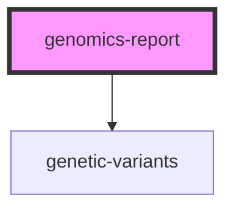

# genomics-report


<!-- Auto Generated Below -->


## Properties

| Property                        | Attribute                          | Description                                                                                                                                          | Type      | Default     |
| ------------------------------- | ---------------------------------- | ---------------------------------------------------------------------------------------------------------------------------------------------------- | --------- | ----------- |
| `enableAllVariants`             | `enable-all-variants`              | If `true`, the component will show All Variants unfolded when first opened.                                                                          | `boolean` | `true`      |
| `enableRelevantVariants`        | `enable-relevant-variants`         | If `true`, the component will show Relevant Variants unfolded when first opened.                                                                     | `boolean` | `false`     |
| `fhirBaseUrl` _(required)_      | `fhir-base-url`                    | Base URL to fhir-resource                                                                                                                            | `string`  | `undefined` |
| `hideLinkVariantBrowser`        | `hide-link-variant-browser`        | If `true`, the table will include a column to show a link to open the Variant Browser.                                                               | `boolean` | `false`     |
| `idGenomicsReport` _(required)_ | `id-genomics-report`               | ID of the to be requested resource                                                                                                                   | `string`  | `undefined` |
| `idImportantVariantsList`       | `id-important-variants-list`       | Id of the list of important variants                                                                                                                 | `string`  | `undefined` |
| `locale`                        | `locale`                           | Language property of the component. </br> Currently suported: [de, en]                                                                               | `string`  | `"en"`      |
| `metaAsTable`                   | `meta-as-table`                    | If `true`, the component will show meta informations as a table.                                                                                     | `boolean` | `false`     |
| `tableBackground`               | `table-background`                 | Defines colour of the background of *genetic-variants*-table                                                                                         | `string`  | `"#ecf0f1"` |
| `tableHeaderBackground`         | `table-header-background`          | Defines colour of the header background of *genetic-variants*-table                                                                                  | `string`  | `"#ecf0f1"` |
| `tableRelevantBackground`       | `table-relevant-background`        | Defines colour of the background of *genetic-variants*-table containing relevant variants                                                            | `string`  | `"#8fd0e3"` |
| `tableRelevantHeaderBackground` | `table-relevant-header-background` | Defines colour of the header background of *genetic-variants*-table containing relevant variants                                                     | `string`  | `"#8fd0e3"` |
| `token`                         | `token`                            | Authentication token that will be added to the Authorization Header within all request in the fhir-server. </br> ```Authorization: Bearer <token>``` | `string`  | `undefined` |


## Events

| Event           | Description | Type               |
| --------------- | ----------- | ------------------ |
| `errorOccurred` |             | `CustomEvent<any>` |


## Dependencies

### Depends on

- [genetic-variants](../genetic-variants)

### Graph


----------------------------------------------

*Built with love! by MOLIT Institut gGmbH ❤❤*
