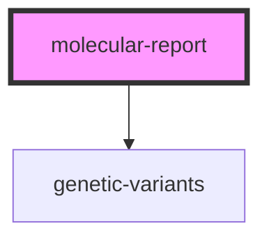

# molecular-report


<!-- Auto Generated Below -->


## Properties

| Property                         | Attribute                          | Description                                                                                                                                          | Type      | Default     |
| -------------------------------- | ---------------------------------- | ---------------------------------------------------------------------------------------------------------------------------------------------------- | --------- | ----------- |
| `enableRelevantVariants`         | `enable-relevant-variants`         | TODO Funtionalty to be added                                                                                                                         | `boolean` | `false`     |
| `fhirBaseUrl` _(required)_       | `fhir-base-url`                    | Base URL to fhir-resource                                                                                                                            | `string`  | `undefined` |
| `idMolecularReport` _(required)_ | `id-molecular-report`              | ID of the to be requested resource                                                                                                                   | `string`  | `undefined` |
| `tableBackground`                | `table-background`                 | Defines colour of the background of *genetic-variants*-table                                                                                         | `string`  | `"#ecf0f1"` |
| `tableHeaderBackground`          | `table-header-background`          | Defines colour of the header background of *genetic-variants*-table                                                                                  | `string`  | `"#ecf0f1"` |
| `tableRelevantBackground`        | `table-relevant-background`        | TODO Funtionalty to be added                                                                                                                         | `string`  | `"#ecf0f1"` |
| `tableRelevantHeaderBackground`  | `table-relevant-header-background` | TODO Funtionalty to be added                                                                                                                         | `string`  | `"#ecf0f1"` |
| `token`                          | `token`                            | Authentication token that will be added to the Authorization Header within all request in the fhir-server. </br> ```Authorization: Bearer <token>``` | `string`  | `undefined` |


## Events

| Event           | Description | Type               |
| --------------- | ----------- | ------------------ |
| `errorOccurred` |             | `CustomEvent<any>` |


## Dependencies

### Depends on

- [genetic-variants](../genetic-variants)

### Graph


----------------------------------------------

*Built with love! by MOLIT Institut gGmbH ❤❤*
